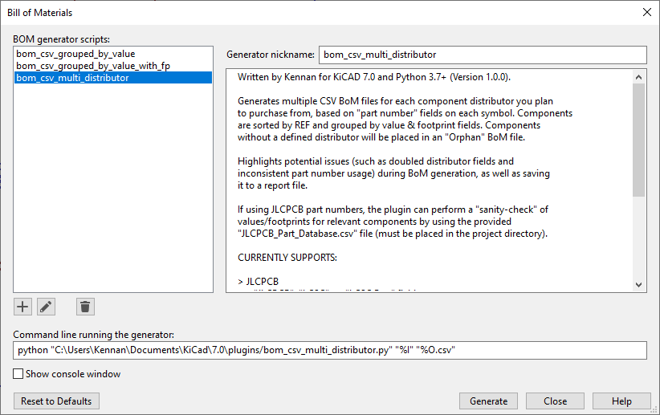
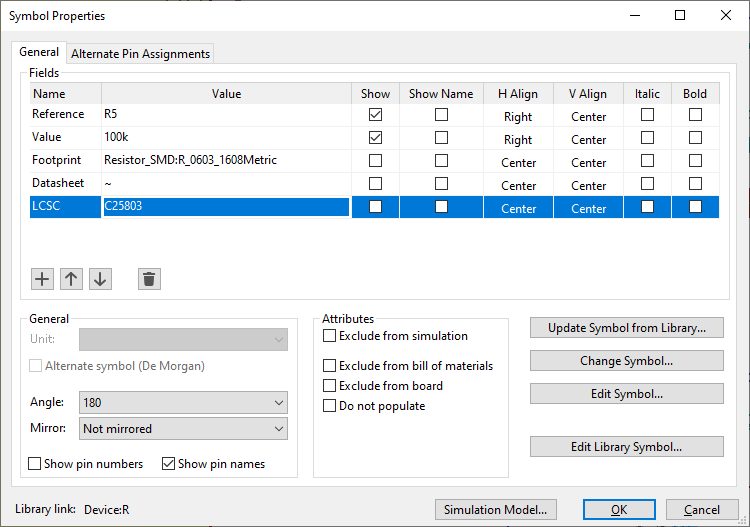
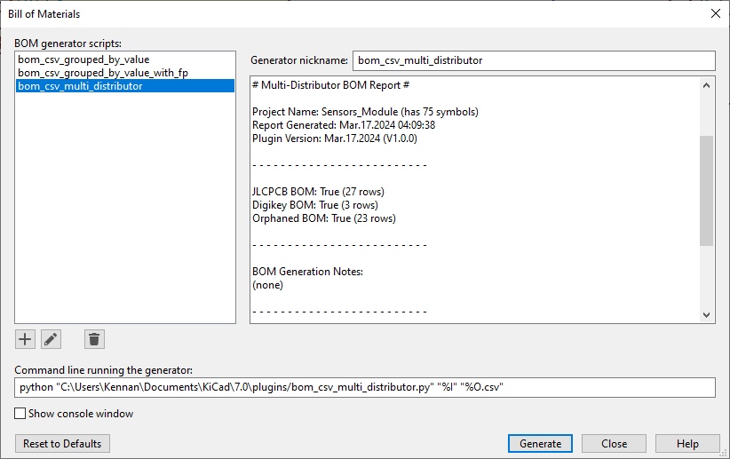

# KiCAD Multi-BoM Plugin

This project is a KiCAD Bill-of-Materials (BoM) plugin which generates multiple BoM files for each component distributor you plan to purchase from, based on "part number" fields on each symbol. Symbols without a defined distributor will be placed in an "Orphan" BOM file for manual review. The plugin can produce a BoM that can be used for JLCPCB's PCB assembly service, and a BoM that can be used with Digikey's Parts List Manager.

## Quick Access
1. [Introduction](#introduction)
2. [Features](#features)
3. [Installation](#installation)
4. [Usage](#usage)
5. [Future Plans](#future-plans)


## Introduction

As I design schematics I usually add fields to my symbols with distributor part numbers for future reference. I primarily use JLCPCB for PCB fabrication and use their in-house PCB Assembly for some components, then order the remaining parts from Digikey for manual assembly. To simplify the final review and ordering process, I wanted to create a BoM plugin that can handle all these fields and make the multiple BoM files automatically.

While I made this plugin to fit my specific design process and workflow, I tried to make it generic enough to adapt to broader use-cases. There are no doubt many KiCAD BoM plugins out there that could work for my purposes, but writing my own gives me much finer control and better integration with my process.

To adapt the plugin to my workflow, I opted to include several distributors and functions in a single plugin, as opposed to having multiple plugins with narrower scopes. This makes the BoM export process simpler and faster, as well as allowing for full coverage of parts - if a symbol is lacking any recognizable distributor part numbers, I want them to be flagged in a different file for manual review (as it could be a mistake).

I added some quality-of-life features such as checking if a component has multiple distributors defined, or identical components have differing part numbers. I also added a "sanity check" for JLCPCB parts, where it compares known details of parts to details of the symbols in the schematic, highlighting any gross mismatches. This system can also suggest suitable Basic parts to replace Extended parts.


### Inspiration
The project was originally inspired by [Wokwi's JLCPCB BoM Plugin](https://github.com/wokwi/kicad-jlcpcb-bom-plugin) - if you just want a simple plugin for exporting a BoM for JLCPCB's PCB Assembly, that should do the trick as well. (Do note that if you have multiple identical components but assign different JLCPCB numbers, Wokwi's plugin will only use the first one it finds and ignore the rest. This could be an issue if you're using something like X7R and X5R capacitors of identical footprint/value. My plugin does not have this behaviour and keeps both JLCPCB part numbers).


## Features
- Can generate a CSV BoM file for JLCPCB's PCB Assembly service (LCSC parts)
	- Columns: `"Comment", "Designator", "Footprint", "LCSC Part #"`
- Can generate a CSV BoM file that can be used with Digikey's Parts List Manager
	- Columns: `"Customer Reference", "Note", "Reference Designator", "Footprint", "Digi-Key Part Number", "Quantity"`
- Adds components without distributors to an "Orphan" BoM file for manual review
	- Columns: `"Comment", "Designator", "Footprint"`
- Automatically decides which BoM files to generate based on what part numbers are present
- Highlights potential errors (such as doubled distributor fields or inconsistent part numbers) during BoM generation
- Details of BoM generation are also logged to a report `txt` file
- Can perform a "sanity check" of values/footprints for some JLCPCB parts
	- Can also suggest part replacements when Extended parts can be replaced with a Basic ones
	- Requires the "JLCPCB_Part_Database.csv" file to be placed in plugin directory


## Installation

This plugin has been verified to work with KiCAD 7.0.8 (Python 3.9.16) on Windows 10 and MacOS 13.4 (tested V1.0.3). It should theoretically work cross-platform with Python 3.7 and above.

The plugin requires the [KiCAD Netlist Reader module](https://pypi.org/project/kicad-netlist-reader/). This should be installed with KiCAD, but if for some reason it isn't you can launch the "KiCAD Command Prompt" as administrator (located at `/KiCad/7.0/bin/kicad-cmd.bat` on Windows), then invoke `pip install kicad-netlist-reader` to install the module in your KiCAD environment. Alternatively, you can manually download the file from the [KiCAD GitHub Repository](https://github.com/KiCad/kicad-source-mirror/blob/master/eeschema/python_scripts/kicad_netlist_reader.py) and place it alongside the plugin file.


### Installation Steps
1. Download and place the `bom_csv_multi_distributor.py` file in your KiCAD plugin directory
	- On Windows this is under `.\Documents\KiCAD\7.0\plugins`
2. (Optional) Download and place the `JLCPCB_Part_Database.csv` file in your KiCAD plugin directory
3. Open the KiCAD Schematic Editor
4. From the "Tools" dropdown select "Generate BOM"
5. At the bottom left, press the "+" button
6. Navigate to the plugin folder and select the `bom_csv_multi_distributor.py` file
7. (Optional) Add a nickname to the generator script
8. Ensure the "Command Line" command contains the project directory (`%I`) as the first argument
	- This should be the default configuration already
	- The output location is the project directory; the `$O` argument is currently ignored

Your Bill of Materials window should now look something like this:



## Usage

To make use of this plugin, you first have to perform setup by adding part numbers to all your symbols. After this step is complete, you can then generate the BoM. You can find part numbers on the distributor's website, such as [JLCPCB's Part List](https://jlcpcb.com/parts) or [Digikey's Catalogue](https://digikey.ca)

### Adding Part Number Fields

1. Select a symbol and open its Properties (press "E")
2. Press the "+" button to add a field
3. Name the field based on your component distributor, then add the part number as the "Value"
	- Refer to the table below for acceptable field names
	- See image below as an example
4. Repeat steps 1-3 for all symbols



| Distributor   | Accepted Field Names 					| Example Part Number |
| ------------- | ------------- 						| -------------       |
| JLCPCB PCBA   | "LCSC", "LCSC Part", "JLCPCB"  		| C14663	          |
| Digikey  	    | "Digikey", "Digi-Key", "Digi-Key_PN"  | 296-53541-1-ND      |


### Generating the BoM

1. Open the "Generate BOM" menu (under the Tools dropdown)
2. Select "bom_csv_multi_distributor" from the list of scripts on the left
3. Press the "Generate" button at the bottom right

The script should then produce several output files in your current project's directory (alongside your schematic file). One of these files is the `Project_BOM_Report.txt` file, which contains details about the BoM generation (including any warnings). The contents of this file are also displayed in the KiCAD window (see below).



In addition to the report, at least one CSV BoM file should have been created based on which distributor(s) you plan to use.

- The `Project_BOM_JLCPCB.csv` file contains all JLCPCB parts. The file is directly compatible with JLCPCB's PCB Assembly service.
- The `Project_BOM_Digikey.csv` file contains all Digikey parts. The file can be used with Digikey's Parts List Manager, or to manually produce an order.
- The `Project_BOM_Orhpaned.csv` file contains all the remaining parts that did not have a defined distributor. This file can be manually reviewed to ensure no parts have been unintentionally missed.


### JLCPCB Sanity Checker

If you're using JLCPCB components and have placed the `JLCPCB_Part_Database.csv` file in your KiCAD plugin directory, the report file should also contain a JLCPCB "sanity check" at the bottom. This simply compares details of symbols with LCSC part numbers to known-details in the parts database, highlighting any discrepencies. Below is the meaning of the categories:

- "PASS" means a symbol reasonably matches the part definitions
	- Symbols that pass are not listed in the report
	- This is not a guarantee the symbol is correct
	- It should work reasonably well for passive components
- "SUSPECT" means a symbol may not match with the part and should be reviewed
	- This is not a guarantee there is a problem; there are false positives
- "NOT IN DATABASE" means the JLCPCB part is not in the part database and thus cannot be evaluated
	- You can manually add parts to the database file to fix this

Note: As I add more parts to the `JLCPCB_Part_Database.csv` file and it grows in size, the impact on loading time will become more significant. To reduce these effects the database is cached (pickled) after the first execution. This means the first run of the plugin will be slower than subsequent runs. The cached database will also be re-generated any time the plugin or database CSV are updated.

### Performance Settings

By default the plugin is optimized for the fastest execution time. Some optimizations could cause issues in niche cases, so certain behaviour can be changed by tweaking the global constants in the plugin:

| Constant              | Default | Behaviour         |
| --------------------- | ------- | ----------------- |
| `DO_PICKLE_JLCPCB_DB` | `True`  | Pickles JLCPCB database for faster repeat loading |
| `DO_DISABLE_GC`       | `True`  | Disables garbage collector to favour performance at cost of RAM usage |


### Sample Output:

`Example_Project_BOM_Report.txt:`
```
# Multi-Distributor BOM Report #

Project Name: Example_Project (has 75 symbols)
KiCad Version: 7.0.8 (Python 3.9.16)
Report Generated: Apr.11.2024 13:43:18
Plugin Version: Apr.11.2024 (V1.0.10)
Execution Time: 23ms

- - - - - - - - - - - - - - - - - - - - - - - - - 

JLCPCB BoM: True (24 rows)
Digikey BoM: True (11 rows)
Orphaned BoM: True (8 rows)

- - - - - - - - - - - - - - - - - - - - - - - - - 

BoM Generation Notes:
- WARN: [C7] has multiple distributors defined (only using first found)
- WARN: Symbols [R5=R6, R7] are identical but have different part numbers

- - - - - - - - - - - - - - - - - - - - - - - - - 

JLCPCB Parts Database File Present: True (354 parts, updated 2024.03.31)
JLCPCB Parts Sanity-Checker (33 pass, 3 suspect, 1 not in database):
- [D3]'s value is "PWR_LED (GRN)", expected "Green"
- [Q2]'s footprint is "SOT-89-3", expected to "SOT-23"
- [U4]'s value is "MMC5633NJL", expected "MMC5603NJ"
- ALT: [R3] Part C22843 (Basic) could replace C114680 (Extended)
- C12345 (Q2) not in database
```

## Tips
- For components that are inherent to the PCB (mounting holes, test pads, solder jumpers, edge connectors), check the "Exclude from bill of materials" checkbox in their properties. This will prevent them for cluttering the Orphaned BoM file.


## Future Plans
- Add more distributors (e.g. Mouser)
- Further develop the JLCPCB Parts Database file
	- Depending on performance with more parts, maybe make a "lite" version with only Basic parts
- Improve footprint comparisons for JLCPCB sanity-check feature (normalizeFootprint() function)
	- This should include footprint aliases (SMB == DO-214AA, DPAK == TO-252-2, SOT23 == TO236, SOIC16 == SOP16)
	- Should also include variant handling (e.g. SOT23 = SOT-23 == SOT23-3 != SOT23-5)
- Improve model/value comparisons for JLCPCB sanity-check feature
	- Ignore spaces,periods,dashes,commas,underscores & case when comparing
		- E.g. "B5819WSL"=="B5819W SL"
		- Maybe just ignore all non alphanumeric characters
		- Also probably make case-insensitive
	- For integers, use an exact comparison. For strings, a substring method is likely suitable.
- Improve code formatting and adherence to PEP8
- Consider respecting the second "output" argument from KiCAD
- Tweak JLCPCB part suggestion check
	- Adjust the footprint comparison to use the normalizeFootprint() system so it is robust with footprint aliases
		- E.g. Can suggest a SOT457 part as a suitable replacement for a TSOP6 part
- Add graceful error handling for permission denied errors
	- These usually stem from having an existing BoM file open in an external program
- Add graceful error handling if KiCAD netlist python module is not installed
- Consider using arguments/envs to configure features (DB pickling, etc)
- Optimize JLCPCBPartDatabase & JLCPCBPartData classes for better serialization
- Switch JLCPCB CSV database to having seperate columns for "Value" and "Model" of parts.
	- This is because, when normalizing values, some part model numbers (e.g. STM32F103C8T6) are actually converted to numeric values. This is undesired behaviour and could lead to confusion.
	- This also means the part hash system may need to be overhauled (or just use (Model or Value)+footprint, so use Model first, then Value if not defined)